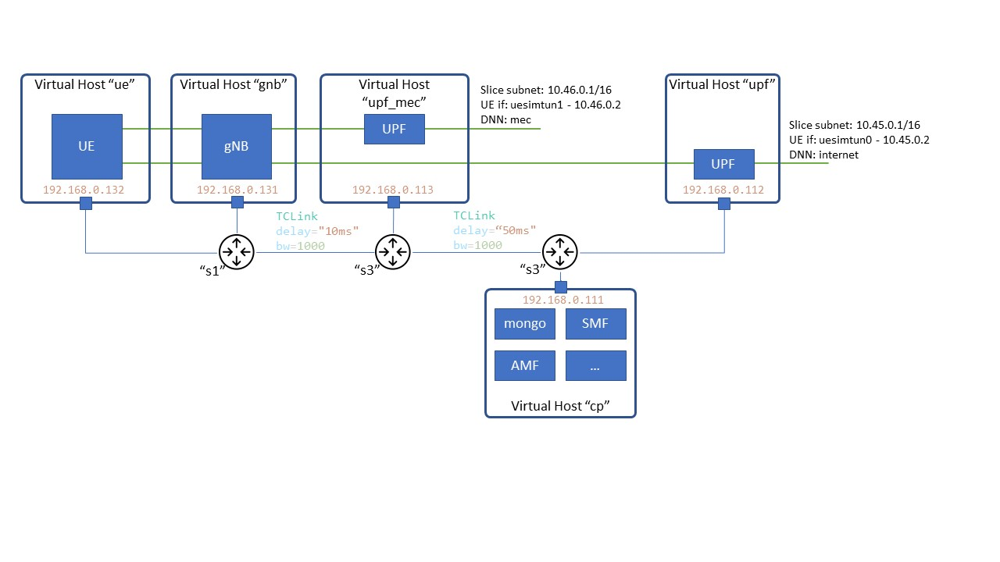

HORSE Prediction and Prevention Digital Twin
============================================
*This is the official repository of the Prediction and Prevention Digital Twin developed within the [HORSE SNS JU project](https://horse-6g.eu).

The Prediction and Prevention Digital Twin is a Network Digital Twin built within a single Virtual Machine for compactness.
It can be run on any PC platform via Vagrant and Virtualbox.

The purpose of the Network Digital Twin is to:
- Emulate a 5G network deployment in comnetsemu.
- Provide REST APIs to control and interact with the Digital Twin engine (for Prediction and Prevention purposes).

Supported open source software:
- Comnetsemu: v0.3.0
- UERANSIM: v3.2.6
- Open5gs: v2.4.2

## Run instructions
In different terminals:

```
./sflow-rt/launch.sh
```

```
sudo python3 [NDT_scenario_file].py
```

```
ryu-manager ryu.app.simple_switch_stp_13 ryu.app.ofctl_rest
```

## Build Instructions

First, install the original comnetsemu VM.

Clone repository in the comnetsemu VM.

Build the necessary docker images:

```
cd build
./build.sh
```

Or alternatively download them from DockerHub

```
cd ../open5gs
./dockerhub_pull.sh
```


## Run experiments

### Start the network topology:

#### Basic deployment scenario

The scenario includes 5 DockerHosts as shown in the figure below.
The UE starts two PDU session one for each slice defined in the core network.

</img>

Notice that at the first run the set-up should not work due to missing information in the 5GC.
To configure it we should leverage the WebUI by opening the following page in a browser on the host OS.
```
http://<VM_IP>:3000/
```

#### Sample HORSE deployment scenario

TBD


### Check UE connections

Notice how the UE DockerHost has been initiated running `open5gs_ue_init.sh` which, based on the configuration provided in `open5gs-ue.yaml`, creates two default UE connections.
The sessions are started specifying the slice, not the APN. The APN, and thus the associated UPF, is selected by the 5GC since, in `subscriber_profile.json`, a slice is associated to a session with specific DNN.

Enter the container and verify UE connections:

``` 
$ ./enter_container.sh ue

# ifconfig
``` 

You should see interfaces uesimtun0 (for the upf_cld) and uesimtun1 (for the upf_mec) active.

```
uesimtun0: flags=369<UP,POINTOPOINT,NOTRAILERS,RUNNING,PROMISC>  mtu 1400
        inet 10.45.0.2  netmask 255.255.255.255  destination 10.45.0.2
        unspec 00-00-00-00-00-00-00-00-00-00-00-00-00-00-00-00  txqueuelen 500  (UNSPEC)
        RX packets 0  bytes 0 (0.0 B)
        RX errors 0  dropped 0  overruns 0  frame 0
        TX packets 0  bytes 0 (0.0 B)
        TX errors 0  dropped 0 overruns 0  carrier 0  collisions 0

uesimtun1: flags=369<UP,POINTOPOINT,NOTRAILERS,RUNNING,PROMISC>  mtu 1400
        inet 10.46.0.2  netmask 255.255.255.255  destination 10.46.0.2
        unspec 00-00-00-00-00-00-00-00-00-00-00-00-00-00-00-00  txqueuelen 500  (UNSPEC)
        RX packets 0  bytes 0 (0.0 B)
        RX errors 0  dropped 0  overruns 0  frame 0
        TX packets 0  bytes 0 (0.0 B)
        TX errors 0  dropped 0 overruns 0  carrier 0  collisions 0
```


Start a ping test to check connectivity:
``` 
# ping -c 3 -n -I uesimtun0 www.google.com
# ping -c 3 -n -I uesimtun1 www.google.com
``` 

### Test the environment

You can run tcpdump software to test correct routing of traffic to the related 5G slices:

``` 
$ ./start_tcpdump.sh upf
``` 

#### Latency test
Enter in the UE container:
``` 
$ ./enter_container.sh ue
``` 

Start ping test on the interfaces related to the two slices:
``` 
# ping -c 3 -n -I uesimtun0 10.45.0.1
# ping -c 3 -n -I uesimtun1 10.46.0.1
``` 

Observe the Round Trip Time using uesimtun0 (slice 1 - reaching the UPF in the "cloud DC" with DNN="internet" ) and ueransim1 (slice 2 - reaching the UPF in the 'mec DC' with DNN="mec")


#### Bandwidth test

Enter in the UE container:
``` 
$ ./enter_container.sh ue
``` 

Start bandwidth test leveraging the two slices:
``` 
# iperf3 -c 10.45.0.1 -B 10.45.0.2 -t 5
# iperf3 -c 10.46.0.1 -B 10.46.0.2 -t 5
``` 

Observe how the data-rate in the two cases follows the maximum data-rate specified for the two slices (2 Mbps for sst 1 and 10Mbps for sst 2).


### Contact

Main maintainer:
- Fabrizio Granelli - fabrizio.granelli@unitn.it

Special Acknowledgements to:
- Riccardo Fedrizzi - rfedrizzi@fbk.eu


